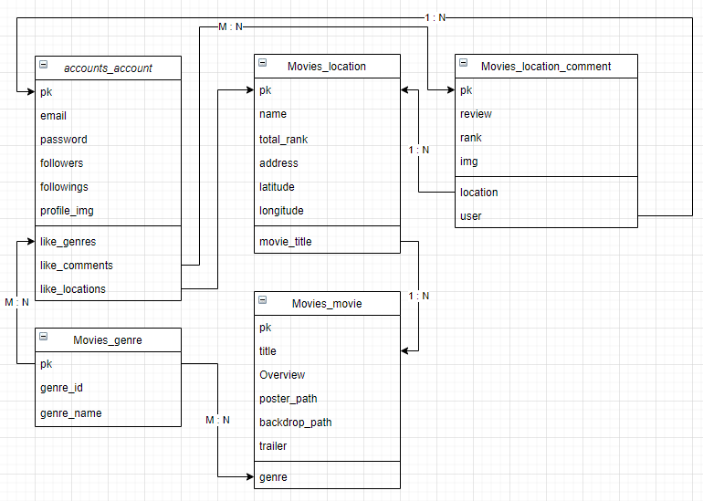

# LetsMoviT BackEnd 구현하기 with Django

[2021.05.19](#2021.05.19)

[2021.05.20](#2021.05.20)


## 2021.05.19

- `accounts/signup/`  기능 구현

  - 현재 논의한 바로는 `signup`은 BackEnd에서

    `login` 은 FrontEnd에서 `JWT` 를 이용하여 구현하는 것으로.

- Detail 페이지에 대한 구상을 완료하고, 그 것을 바탕으로 모델링



---

## 2021.05.20

- 모델링 수정과 함께 `User` 모델에 합쳐져 있던 column 들을 `User` 와 `Profile` 로 구분, 

  - 해당 과정을 진행할 때, `accounts.models.py` 에 `User` 모델이 있더라도 `Profile` 모델에서 `OneToOne` 필드로 관계설정할 때, 

    ​																													`User`를 바로참조하는 것이 아닌 `settings.AUTH_USER_MODEL` 사용

    ```python
    # accounts.models.py
    
    class User(AbstractUser):
        ...
        pass
    
    class Profile(models.Model):
        user = models.ForeignKey(settings.AUTH_USER_MODEL, on_delete=models.CASCADE)
    ```

    

- 해당 `serializers.py` 를 구성하였고, `signup`기능 마무리.

---


`2021.05.21`

- `loaddata` 로 데이터베이스를 구성하려 했으나, 생각보다 `Foreign_Key` 문제가 계속 발생해서 

  `Front` 에서 `Axios` 요청으로 DB에 주입시킴 

  ```javascript
  methods: {
      getData: function () {
        for (let index = 0; index < movies.length; index++) {
          const element = movies[index]
          if (element.model === 'movies.movie') {
            const data = element.fields
            // console.log(data)
  
            axios.post('http://127.0.0.1:8000/movies/', {
              title: data.title,
              overview: data.overview,
              poster_path: data.poster_path,
              backdrop_path: data.backdrop_path,
              vote_average: data.vote_average,
              movie_id: data.movie_id,
            })
              .then((res)=> {
                // store 에 저장
                console.log(res)
                this.$store.dispatch('saveMovieList', res.data)
              })
              .catch((err)=> {
                console.log(err)
              })
          }
          else {
            const data2 = element.fields
            const movie_id = data2.movie_id
            axios.post(`http://127.0.0.1:8000/movies/${movie_id}/locations/`, {
              address: data2.address,
              lat: data2.lat,
              lon: data2.lon,
              name: data2.name,
            })
              .then((res)=>{
                this.$store.dispatch('saveLocationList', res.data)
              })
              .catch((err)=>{
                console.log(err)
              })
          }
        }      
      }
    },
    created: function () {
      this.getData()
    }
  ```

  

- `Location` 모델에 `ImageField` 필드추가.

  ```python
  ```

  